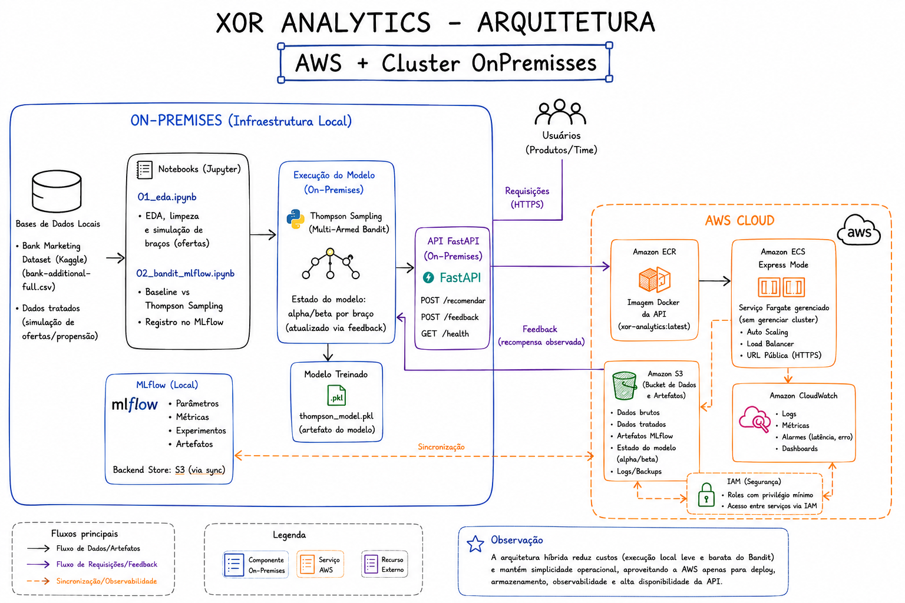

# Datathon 7MLET — - XOR ANALYTICS

**Grupo Jhoe Hashimoto**

VIDEO PITCH:
https://youtu.be/Khx_RAUbhhc

## Visão do problema

Uma instituição financeira digital precisa decidir, em diferentes canais, qual oferta
apresentar para cada cliente elegível. Regras fixas e testes A/B longos desperdiçam
tráfego e demoram a reagir a mudanças de contexto. Este projeto implementa uma
abordagem adaptativa (**multi-armed bandit**, via **Thompson Sampling**) que aprende
com as respostas observadas e supera uma política de regra fixa (baseline).

**Base de dados:** [Bank Marketing Dataset](https://www.kaggle.com/datasets/henriqueyamahata/bank-marketing)
Usada como proxy de propensão/conversão de clientes bancários. A coluna `duration` foi
removida por vazamento temporal (só é conhecida após a ligação ocorrer). Não há dados
reais de clientes, identificadores, renda, gênero ou raça — a base é pública e anonimizada.

## Arquitetura da solução




```
notebooks/01_eda.ipynb          -> EDA, limpeza e simulação de braços (ofertas)
notebooks/02_bandit_mlflow.ipynb -> Baseline vs Thompson Sampling + registro no MLflow
src/bandit.py                   -> implementação reutilizável do Thompson Sampling
src/api.py                      -> API FastAPI que serve a recomendação
Dockerfile                      -> empacotamento para deploy na AWS (ECS Express Mode)
data/                           -> dados brutos, tratados e modelo treinado (.pkl)
```


## Como executar localmente

1. Clone o repositório e crie um ambiente virtual:
   ```bash
   python -m venv .venv
   source .venv/bin/activate  # Windows: .venv\Scripts\activate
   pip install -r requirements.txt
   ```

2. Baixe o dataset do Kaggle (`bank-additional-full.csv`) e salve em `data/`.

3. Rode os notebooks em ordem:
   ```bash
   jupyter notebook notebooks/01_eda.ipynb
   jupyter notebook notebooks/02_bandit_mlflow.ipynb
   ```
   O segundo notebook gera `data/thompson_model.pkl`, usado pela API.

4. Suba a API:
   ```bash
   uvicorn src.api:app --reload --port 8000
   ```
   Teste:
   ```bash
   curl -X POST http://localhost:8000/recomendar \
     -H "Content-Type: application/json" \
     -d '{"idade": 35, "profissao": "admin.", "estado_civil": "married"}'
   ```

5. Visualize os experimentos no MLflow:
   ```bash
   mlflow ui --backend-store-uri file:./mlruns
   ```
   Acesse `http://localhost:5000`.

## Algoritmo

- **Baseline determinístico**: observa uma janela inicial de clientes (warmup) e passa a
  recomendar sempre a oferta com maior taxa histórica de conversão — simula uma regra
  de negócio fixa.
- **Thompson Sampling**: mantém uma distribuição Beta(alpha, beta) por braço (oferta),
  com prior não-informativo Beta(1,1). A cada rodada, amostra da posterior de cada braço
  e escolhe o maior valor amostrado (exploração bayesiana), depois atualiza a posterior
  com a recompensa observada.
- Resultado: o Thompson Sampling supera o baseline em taxa de conversão acumulada no momento inicial até 10k, mas depois se iguala com o baseline, é possível calibrar diminuindo o baseline warmup e ajustando os arms_factors de oferta A,B,C . Foi utilizado Oferta_A = 1, Oferta_B = 0.85 E Oferta_C = 1.15
  (ver gráfico e métricas no notebook `02_bandit_mlflow.ipynb` e no MLflow).

## Golden Set

5 clientes de exemplo com a oferta recomendada pelo modelo estão documentados na
seção final do notebook `02_bandit_mlflow.ipynb`.

## Deploy da demo

A API foi publicada na AWS via **Amazon ECS Express Mode**, usando a mesma imagem
Docker versionada no Amazon ECR (`xor-analytics:latest`). Optei pelo ECS Express Mode
em vez do AWS App Runner porque, a partir de 30/04/2026, o App Runner deixou de aceitar
novos clientes — a própria AWS recomenda o ECS Express Mode como substituto oficial,
mantendo a mesma simplicidade de deploy (uma imagem no ECR gera automaticamente um
serviço Fargate, Load Balancer, auto scaling e uma URL pública).

**URL da API em produção:** `https://xo-2bc1a381e7d940faa460f33faaea4808.ecs.us-east-1.on.aws/docs`

## Arquitetura-alvo em nuvem (AWS)

Para colocar essa solução em produção, usamos o **Amazon S3** para versionar os
dados brutos, tratados e os artefatos do MLflow (bucket dedicado como backend store).
O treinamento do bandit rodaria em uma rotina agendada no **Amazon ECS Fargate**
(ou uma função **AWS Lambda**, dado o baixo custo computacional do Thompson Sampling),
persistindo o estado do modelo (alpha/beta por braço) de volta no S3. A API FastAPI
seria empacotada em container e publicada no **Amazon ECR**, servida por
**Amazon ECS Express Mode** (opção mais simples, sem gerenciar cluster manualmente —
substituto oficial do AWS App Runner desde abril de 2026) ou ECS Fargate clássico
atrás de um **Application Load Balancer**. Autenticação e acesso entre serviços via
**IAM roles** com privilégio mínimo, e observabilidade (logs, métricas, alarmes de
latência/erro) via **Amazon CloudWatch**. Decisões sensíveis mantêm humano no loop:
o endpoint `/feedback` registra o resultado observado antes de qualquer atualização
de política.

### Passo a passo de deploy na AWS (ECS Express Mode)

1. **Criar bucket S3** para dados e artefatos MLflow:
   ```bash
   aws s3 mb s3:/datathon_7mlet_jhoehashimoto_xor_analytics-grupo-xx-mlflow
   ```

2. **Criar repositório no ECR:**
   ```bash
   aws ecr create-repository --repository-name xor-analytics
   ```

3. **Build e push da imagem Docker:**
   ```bash
   aws ecr get-login-password --region us-east-1 | docker login --username AWS \
  --password-stdin 989879505254.dkr.ecr.us-east-1.amazonaws.com

   git clone https://github.com/JhoeHashimoto/datathon_7mlet_jhoehashimoto_xor_analytics.git
   cd datathon_7mlet_jhoehashimoto_xor_analytics/

   docker build -t xor-analytics .
   docker tag xor-analytics:latest 989879505254.dkr.ecr.us-east-1.amazonaws.com/xor-analytics:latest
   docker push 989879505254.dkr.ecr.us-east-1.amazonaws.com/xor-analytics:latest
   ```

4. **Criar o serviço no Amazon ECS Express Mode** apontando para a imagem no ECR:
   - Console AWS → Elastic Container Service → Express mode → Browse ECR images
   - Selecionar a imagem `xor-analytics:latest`
   - Task execution role / Infrastructure role: "Create new role" (primeira vez)
   - Container port: `8080`
   - Health check path: `/health`
   - Clicar em Create (se der erro de service-linked role na primeira tentativa,
     aguardar alguns segundos e tentar de novo — é comportamento esperado)

5. **Testar o endpoint público** gerado pelo Express Mode:
   ```bash
   curl -X POST https://xo-2bc1a381e7d940faa460f33faaea4808.ecs.us-east-1.on.aws/recomendar \
     -H "Content-Type: application/json" \
     -d '{"idade": 35, "profissao": "admin.", "estado_civil": "married"}'
   ```

6. **(Opcional) IAM Role** com permissão de leitura/escrita no bucket S3, caso a API
   passe a carregar o modelo direto do S3 em vez de empacotado na imagem.

## MLOps — MLflow

Os parâmetros do algoritmo (tipo de bandit, priors, warmup) e as métricas
(taxa de conversão do baseline e do Thompson Sampling, ganho percentual) são
registrados via MLflow local no notebook `02_bandit_mlflow.ipynb`. Print da run
disponível na apresentação/pitch.

## Limitações

- Bandit não-contextual nesta versão do MVP: o contexto do cliente (idade, profissão,
  etc.) ainda não entra como covariável direta na escolha do braço — próximo passo
  natural seria um Thompson Sampling contextual (ex.: regressão logística bayesiana
  por braço).
- Braços (ofertas) são simulados a partir de fatores multiplicativos sobre a
  propensão real, já que a base Kaggle não tem múltiplas ofertas nativamente —
  decisão documentada no notebook de EDA.
